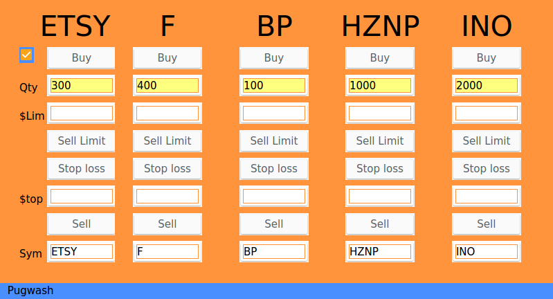
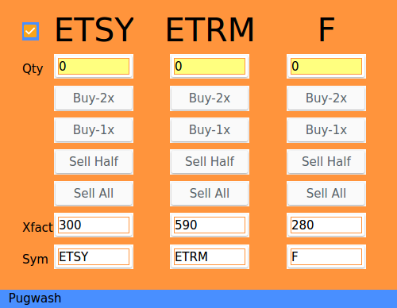
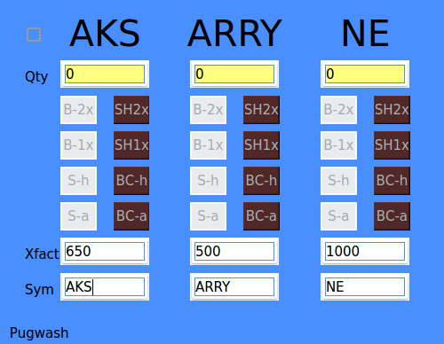

# Etrade HotKeys

This project is licensed under the terms of the MIT license.

The motivation for this project was to allow Etrade buys and sells to be made more quickly than is possible using the tools built into etradePro. This is achieved by eliminating the "Preview" step and "Cancelled due to timeout" that occurs in etradePro if you leave the preview open too long before placing your trade. THIS MAKES HOTKEYS A VERY DANGEROUS TOOL TO USE IF YOU MAKE A MISTAKE WHEN CLICKING "BUY" OR "SELL". Be sure you really intend to place the trade before clicking any button.

**Update** - this project now has two available user interfaces, the original 'hkeys' described below, and a more advanced 'ahkeys' option that is targeted at active trading, where positions may be accumulated and closed out at various times.

## Standard 'hkeys' layout:


## Advanced 'ahkeys' layout:


## Advanced 'ashkeys' layout with Short Sale keys:


This layout has long buy/sell buttons on the left of each ticker group, and short sell / buy to cover buttons on the right.Al

All transaction-open operations (buy, and sell-short) are based on multiples of the Xfact value, which is calculated from a nominal order value (defined in etrade_settings.py). Transaction-close operations (sell, and buy-to-close) work on either the full open quantity, or half the open quantity. The quantity that can be bought using the nominal order value is calculated **when you type a space character at the end of the ticker symbol**. This is a nasty (but hopefully, temporary) workaround to avoid multiple quote requests before the full ticker is entered.

If STOPLOSS is defined as a non-zero value in etrade_settings.py, a stop loss order is automatically placed whenever a new Buy or Sell Short position is opened. The stoploss order price is calculated from the estimated value of the Buy or Sell Short order, offset by the STOPLOSS value and divided by the number of shares in the transaction. If subsequent orders for the same stock are placed before closing out the position, then additional stoploss orders are NOT generated; you should amend the original stoploss to reflect the number of shares added, and make any changes to the stoploss price you feel are appropriate at the same time.

**Note:** Once you have placed a Long trade or a Short trade on a ticker, the "opposite" trading keys are disabled until you close out your position. If you close out your position by placing a sell or buy to cover through eTrade's tools, then you can manually set the "Quantity" input to zero in order to re-enable the buttons. 

Currently, the layout is selected by editing the class definition for EtradeApp in e-keys.py.

## Description

There is a checkbox in the leftmost column of the tool panel that globally disables or enables all of the buy and sell buttons. The buttons are disabled when the panel opens, and must be armed by clicking in the checkbox before any trades can be placed. I recommend leaving the panel disarmed at all times unless you intend to make a trade.

When the panel is in "Safe" mode, the window background will be blue. When the panel is "Live", then the background will be orange. This can be modified in e-keys.py if you find the colors difficult to differentiate.

This project uses a substantial amount of code from etradePythonAPI (there appear to be two separate identical projects for this on GitHub, I'm not sure whose is the original).

I stripped out the virtual screen and login scraping code from etradePythonAPI & replaced it with a simple browser launcher & raw_input for entering the etrade verification code on the command line.

The frontend is designed using the QT4 Designer utility, then converted to python using:
```
pyuic4 hkeys.ui > hkeys.py
```

This software uses the Etrade REST api to place orders, the order is then processed on Etrade's servers and routed to an exchange.

You will need to apply for an individual consumer key via a secure communication to Etrade Customer Service. You will be issued with a pair of sandbox keys initially, which will allow you to check that the software is installed correctly, then after you complete & return some API access agreements you will recieve keys that will allow you to connect to the live server.

Be aware that when you place test orders on the sandbox server, you will recieve back nonsense order confirmations that will be of the correct type, but for random stock ticker names, prices, and quantities. This is to be expected.

The sandbox and production keys can be placed directly into etrade_settings.py, but if you're likely to share the code or put it into a public repository, it is probably better to put the keys into your .bashrc file (or similar depending on your OS) so that they can be read by the program without being part of the codebase:
```
export ETRADE_SANDBOX_KEY='xxxxxxxxxxxxxxxxxxxxxxxxxxxxxxxx'
export ETRADE_SANDBOX_SECRET='xxxxxxxxxxxxxxxxxxxxxxxxxxxxxxxx'
export ETRADE_PRODUCTION_KEY='xxxxxxxxxxxxxxxxxxxxxxxxxxxxxxxx'
export ETRADE_PRODUCTION_SECRET='xxxxxxxxxxxxxxxxxxxxxxxxxxxxxxxx'
```

THIS SOFTWARE DOES NOT COME WITH ANY WARRANTIES WHATSOEVER. USE AT YOUR OWN RISK
